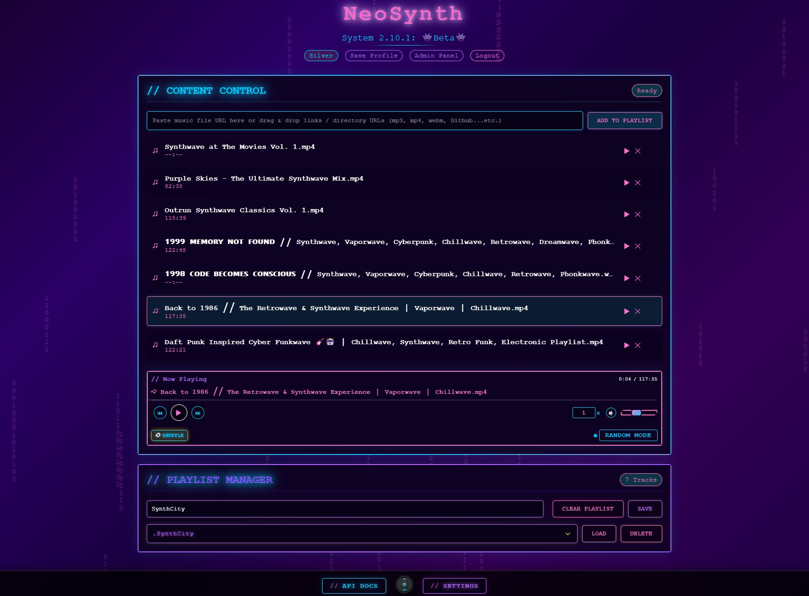

# NeoSynth



NeoSynth is a cyberpunk-themed music and video player web application that allows users to create, save, and manage playlists. Built with a modern tech stack and designed with a neon-infused aesthetic, it provides a unique way to organize and play your media.

## Features

- Play audio and video files from URLs
- Create and manage multiple playlists
- Drag and drop support for links and media files
- Basic local user authentication and profile saving
- Shuffle mode with intelligent track selection
- Responsive design for both desktop and mobile
- Persistent settings and preferences

## Technology Stack

- **Frontend**: Vanilla JavaScript, HTML5, CSS3
- **Backend**: Node.js, Express
- **Database**: MongoDB
- **Deployment**: Docker and Kubernetes ready

## Getting Started

### Prerequisites

- Node.js (v16 or higher)
- MongoDB (v4.4 or higher)
- npm or yarn

### Installation

1. Clone the repository:
   ```
   git clone https://github.com/yourusername/neosynth.git
   cd neosynth
   ```

2. Install dependencies:
   ```
   cd backend
   npm install
   ```

3. Set up your environment variables:
   Create a `.env` file in the backend directory with:
   ```
   MONGODB_URI=mongodb://localhost:27017/neosynth
   PORT=5000
   ```

4. Start the application:
   ```
   cd backend
   npm start
   ```

5. Access the application at `http://localhost:5000`

### Docker Deployment

```
docker build -t neosynth:latest .
docker run -p 5000:5000 -p 80:80 neosynth:latest
```

### Kubernetes Deployment

Apply the included Kubernetes configuration:

```
kubectl apply -f k8s/deployment.yaml
```

## Project Structure

- `/frontend`: Contains all client-side code including HTML, CSS, and JavaScript
- `/backend`: Contains the Express server, API routes, and database models
- `/k8s`: Kubernetes deployment configuration

## Contributing

Pull requests are welcome. For major changes, please open an issue first to discuss what you would like to change.

## License

This project is licensed under the Creative Commons Attribution-NonCommercial-ShareAlike 4.0 International License - see the [LICENSE](LICENSE) file for details.

**Commercial use is prohibited.** For commercial licensing inquiries, please contact the project maintainer.