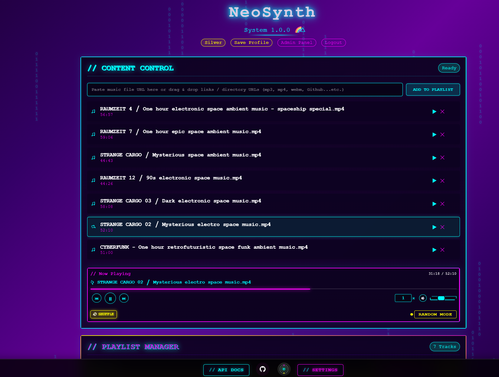

<div align="center">

# NeoSynth

*A cyberpunk themed music and video streaming web application that allows users to create, save, and manage playlists. Built with modern features and designed with a neon-infused aesthetic, it provides a unique way to organize and play your media!*



---

</div>

## Features

- Play audio and video files from network locations / storage
- Create and manage multiple playlists
- Shuffle mode with intelligent track selection
- Responsive design for both desktop and mobile
- Multiple themes ready to use
- Feature flag system
- Modular features and CSS design allowing easy contributions

---

## Quick Start

### Production Deployment

For production deployments using Docker Compose or Kubernetes, see our comprehensive [Deployment Guide](deployments/README.md).

### Development Setup

For local development:

1. **Prerequisites:**
   - Node.js (v16 or higher)
   - MongoDB (v7 or higher)
   - npm or yarn

2. **Clone and install:**
   ```bash
   git clone https://github.com/isolinear-labs/Neosynth
   cd Neosynth
   cd backend
   npm install
   ```

3. **Set up environment variables:**
   ```bash
   NODE_ENV=development
   FRONTEND_URL=http://localhost:5000
   MONGODB_URI="mongodb://localhost:27017/neosynth"
   COOKIE_SECRET="dev_cookie_secret"
   TOTP_ENCRYPTION_KEY="dev_totp_key"
   ```

4. **Start the application:**
   ```bash
   npm start
   ```

5. **Access:** http://localhost:5000

---

## Contributing

Docs coming soon...

---

## License

This project is licensed under the Creative Commons Attribution-NonCommercial-ShareAlike 4.0 International License - see the [LICENSE](LICENSE) file for details.

**Commercial use is prohibited.** For commercial licensing inquiries, please contact the project maintainer.